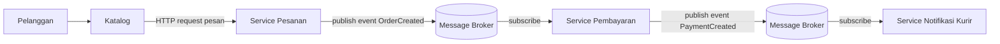
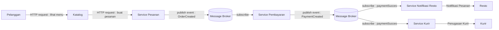

# Jurnal Proses — Tugas 2

## [28 September 2026]
- Opsi arsitektur yang dipertimbangkan: SOA + Pub-Sub
- Kenapa akhirnya pilih [SOA/Pub-Sub]: Kami sepakat menggunakan kombinasi SOA + Pub-Sub. SOA untuk memisahkan menjadi beberapa service sesuai fungsinya. Sehingga, setiap service akan memiliki tugas masing-masing. Pub-Sub digunakan sebagai komunikasi untuk mengurangi ketergantungan. Jadi komunikasi antar service dilakukan melalui message broker, sehingga service tidak perlu terhubung secara langsung. Service cukup mengirim informasi ke message broker lalu pesan akan disebarkan kepada service yang berlangganan.

### Revisi 1

Pada diagram pertama alur setelah pembayaran masih belum sempurna karena setelah melakukan pembayaran belum menunjukkan proses penugasan kurir mengantar makanan

### Revisi 2

Pada diagram kedua proses dimulai saat pelanggan melihat menu/katalog dengan mengirimkan HTTp request ke service katalog, lalu katalog akan memberikan data-data menu ke pelanggan. Komunikasi ini bersifat sinkron dengan menggunakan request-respons karna pelanggan menunggu respons dari service katalog dulu. Setelah itu, pelanggan membuat pesasan menggunakan HTTP request di service pesanan. Kemudian pada service pesanan melakukan publish event OrderCreated ke Message broker. Komunikasi pesanan dari Message broker ini bersifat asinkron dan menggunakan event.

Service pembayaran melakukan subscribe di event OrderCreated dari Message broker. Setelah itu service pembayaran memproses pembayaran. Jika berhasil service pembayaran melakukan publish PaymentSucces ke massage broker. Komunikasi ini bersifat asinkron.

Lalu pada revisis 2 ini menambahkan service kurir sebagai komponen terpisah dan mengubah notifikasi jadi service notifikasi resto. Setelah event paymentSucces , kemudian di subscribe oleh notifikasi resto dan service kurir secara terpisah. Jadi restonya dapat menerima notifikasi pesanan dan kurir dapat diproses untuk diberi penugasan tanpa service notifikasinya terhubung langsung dengan kurir.

Trade-off : Pada Pub-Sub pesan mungkin bisa saja tidak sampai pada server tujuan, dikarenakan mungkin terjadi keterlambatan atau error sehingga diperlukan mekanisme penyimpanan pesan yang gagal diterima atau terlambat dan pengiriman ulang pesan yang akan membuat sistem jauh lebih kompleks.

## Log Penggunaan AI (Level 2)

> Wajib diisi sesuai kebijakan Level 2 di [`../RUBRIK-UMUM.md`](../RUBRIK-UMUM.md). Tulis "Tidak memakai AI" pada baris pertama jika memang tidak dipakai. Hanya untuk brainstorming ide/outline — bukan untuk kode/analisis/teks akhir.

| Tanggal | Tool AI | Prompt yang diberikan | Ringkasan saran/ide AI | Bagaimana diolah jadi tulisan/kode sendiri |
|---|---|---|---|---|
| 29/09/2026 | ChatGpt | Kalau Pub-Sub mengurangi ketergantungan antar-service, apakah sistem berarti menjadi lebih sederhana | Ketergantungan bisa berkurang tapi memuncul kompleksitas baru | menjadikan pengurangan ketergantungan sebagai keuntungan dan kompleksitas pengelolaan pesan sebagai trade-off |
