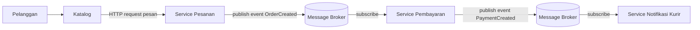

# Jurnal Proses — Tugas 2

## [28 September 2026]
- Opsi arsitektur yang dipertimbangkan: SOA + Pub-Sub
- Kenapa akhirnya pilih [SOA/Pub-Sub]: ...
- Revisi diagram (versi 1 → versi 2, apa yang berubah dan kenapa): ...

## Log Penggunaan AI (Level 2)

> Wajib diisi sesuai kebijakan Level 2 di [`../RUBRIK-UMUM.md`](../RUBRIK-UMUM.md). Tulis "Tidak memakai AI" pada baris pertama jika memang tidak dipakai. Hanya untuk brainstorming ide/outline — bukan untuk kode/analisis/teks akhir.

| Tanggal | Tool AI | Prompt yang diberikan | Ringkasan saran/ide AI | Bagaimana diolah jadi tulisan/kode sendiri |
|---|---|---|---|---|
| ... | ... | ... | ... | ... |
