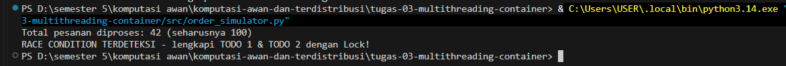
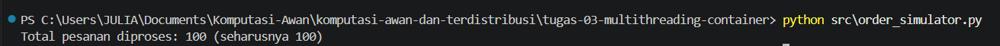

# Jurnal Proses — Tugas 3

## Percobaan tanpa Lock
- Hasil `processed_count` yang didapat: 42
- Kenapa bisa meleset (jelaskan mekanisme race condition dengan kata sendiri): Soalnya thread mengubah dan mengakses processed_count dengan bersamaan. Jadi 2 thread membaca nilai count yang sama sebelum salah satu nilainya diperbarui. Habis itu keduanya melakukan increment 1 dan menyimpan hasil yang sama, sehingga salah satu dari penambahan itu tidak tercatat dan jumlah processed_count jadi lebih kecil dari jumlah pesanan yang asli yaitu 100

## Percobaan dengan Lock
- Hasil `processed_count` setelah perbaikan: 100
- Perbaikan yang dilakukan: Untuk mengatasi masalah pada percobaan sebelumnya, ditambahkan `threading.Lock()` untuk mengatur akses thread terhadap `processed_count`. Dengan adanya `Lock`, thread harus bergantian ketika mengakses dan mengubah nilai `processed_count`. Jadi, pada saat satu thread sedang menambahkan nilai `processed_count`, thread yang lain harus menunggu sampai prosesnya selesai agar tidak terjadi penambahan yang tertimpa ataupun terlewat oleh thread yang lain. Hasil yang didapat setelah menggunakan `Lock` `sesuai dengan jumlah pesanan yang harus diproses yang berarti race condition di percobaan sebelumnya berhasil diperbaiki.

## Kendala Docker
- Error yang ditemui saat `docker build`/`docker run` dan cara memperbaikinya: ...

## Log Penggunaan AI (Level 2)

> Wajib diisi sesuai kebijakan Level 2 di [`../RUBRIK-UMUM.md`](../RUBRIK-UMUM.md). Tulis "Tidak memakai AI" pada baris pertama jika memang tidak dipakai. Hanya untuk brainstorming ide/outline — bukan untuk kode/analisis/teks akhir.

| Tanggal | Tool AI | Prompt yang diberikan | Ringkasan saran/ide AI | Bagaimana diolah jadi tulisan/kode sendiri |
|---|---|---|---|---|
| ... | ... | ... | ... | ... |
