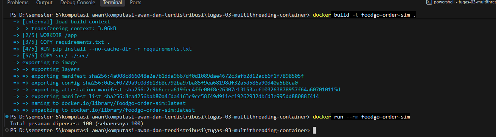

# Jurnal Proses — Tugas 3

## Percobaan tanpa Lock
- Hasil `processed_count` yang didapat: 42
- Kenapa bisa meleset (jelaskan mekanisme race condition dengan kata sendiri): Soalnya thread mengubah dan mengakses processed_count dengan bersamaan. Jadi 2 thread membaca nilai count yang sama sebelum salah satu nilainya diperbarui. Habis itu keduanya melakukan increment 1 dan menyimpan hasil yang sama, sehingga salah satu dari penambahan itu tidak tercatat dan jumlah processed_count jadi lebih kecil dari jumlah pesanan yang asli yaitu 100

## Percobaan dengan Lock
- Hasil `processed_count` setelah perbaikan: 100
- Perbaikan yang dilakukan: Untuk mengatasi masalah pada percobaan sebelumnya, ditambahkan `threading.Lock()` untuk mengatur akses thread terhadap `processed_count`. Dengan adanya `Lock`, thread harus bergantian ketika mengakses dan mengubah nilai `processed_count`. Jadi, pada saat satu thread sedang menambahkan nilai `processed_count`, thread yang lain harus menunggu sampai prosesnya selesai agar tidak terjadi penambahan yang tertimpa ataupun terlewat oleh thread yang lain. Hasil yang didapat setelah menggunakan `Lock` sesuai dengan jumlah pesanan yang harus diproses yang berarti race condition di percobaan sebelumnya sudah berhasil diperbaiki.

## Setelah memakai docker

Docker digunakan untuk menjalankan program foodGo dalam container. Terlihat pada gambar diatas bahwa program sudah dikemas menggunakan dokcer dan untuk hasilnya masi sesuai yaitu 100 pesanan berhasil diproses

## Kendala Docker
- virtualization not detected, cara mengatasinya dengan mengaktifkan fitur windows hyper-v dan instal wsl, lalu di restart

## Analisis mengapa threading
Dibandingkan dengan membuat proses baru untuk setiap client, thread lebih ringan karena masih di dalam satu proses dan bisa berbagi resource dan penggunaan resource server jadi lebih hemat. Karena thread bisa akses data yang sama secara bersamaan, maka kami menggunakan lock untuk mengatasi masalah race condition yang terjadi karena hal tersebut.

## Log Penggunaan AI (Level 2)

> Wajib diisi sesuai kebijakan Level 2 di [`../RUBRIK-UMUM.md`](../RUBRIK-UMUM.md). Tulis "Tidak memakai AI" pada baris pertama jika memang tidak dipakai. Hanya untuk brainstorming ide/outline — bukan untuk kode/analisis/teks akhir.

| Tanggal | Tool AI | Prompt yang diberikan | Ringkasan saran/ide AI | Bagaimana diolah jadi tulisan/kode sendiri |
|---|---|---|---|---|
| 05-10-2026 | ChatGPT | apa fungsi docker pada simulasi pesanan ini | Memberikan ide bahwa Docker digunakan untuk menjalankan program dalam container dengan environment yang terisolasi dan konsisten. | kelompok kami menggunakan jawaban tersebut untuk membuat penjelasan docker di jurnal.md |
